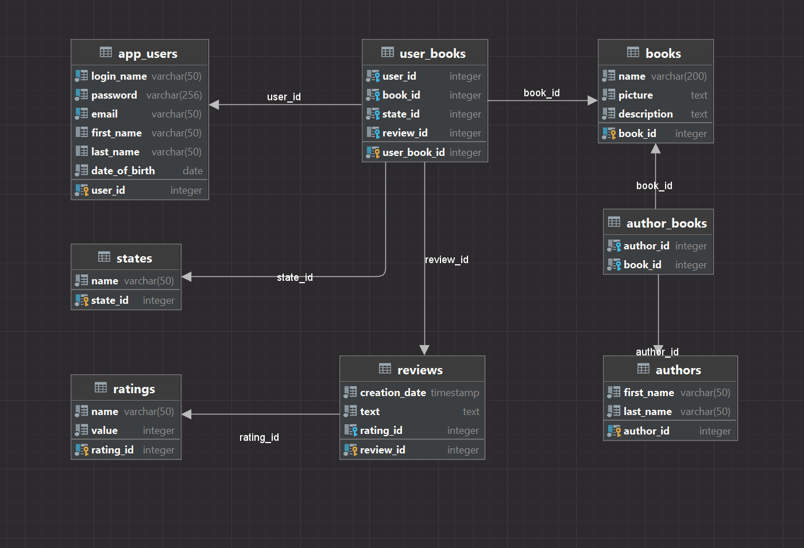

# BookCorner Backend Application

This application serves as backed server for BookCorner web appplication providing API for supporting funcionality in frontend.

## Database model

## Project structure

- `config` - Contaions configuration class for Cross-Origin Resource Sharing (CORS).
- `controllers` - Includes the classes responsible for handling HTTP requests and defining the endpoints for the API.
- `domain` - Contains the classes representing the fundamental business objects in the application.
- `dtos` - Consists of the classes defining the data structures utilized for request and response payloads (Data Transfer Objects).
- `repositories` - Contains the interfaces defining the data access operations for the entities.
- `security` - Contains the configuration for JWT security, which handles authentication and authorization.
- `services` - Contains the service classes that implement repository interfaces, encapsulate the business logic and serve functionalities to the controllers.
